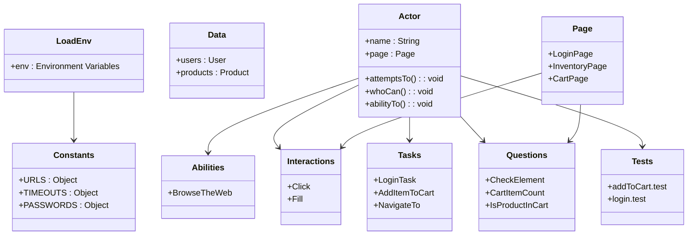

# Playwright POM Screenplay Automation

An end-to-end (E2E) automation project utilizing Playwright, the Page Object Model (POM) pattern, and the Screenplay pattern to test the Sauce Demo web application. The project is structured to ensure modular, maintainable, and scalable test automation, focusing on the interactions between actors and the application under test. The use of the Screenplay pattern allows for clear separation of concerns and enhances test readability and reusability

## Table of Contents

- [Playwright POM Screenplay Automation](#playwright-pom-screenplay-automation)
  - [Table of Contents](#table-of-contents)
  - [Project Overview](#project-overview)
    - [System Architecture Diagram](#system-architecture-diagram)
  - [Technologies Used](#technologies-used)
  - [Prerequisites](#prerequisites)
  - [Project Structure](#project-structure)
  - [Installation](#installation)
    - [Clone the Repository:](#clone-the-repository)
    - [Install Dependencies:](#install-dependencies)
    - [Install Playwright Browsers:](#install-playwright-browsers)
  - [Configuration](#configuration)
      - [Example .env File:](#example-env-file)
    - [Updating `config.js`](#updating-configjs)
  - [Usage](#usage)
    - [Running the Tests](#running-the-tests)

## Project Overview

This project automates the login and product addition to the cart flows of the Sauce Demo web application.

### System Architecture Diagram

The diagram below provides a high-level overview of the relationships between elements of the Screenplay pattern, including actors, tasks, interactions, and pages, illustrating how these components collaborate within the automated testing system.



## Technologies Used

- **Playwright**: A framework for end-to-end testing.
- **Screenplay Pattern**: A design pattern to write flexible and maintainable tests.
- **Node.js**: The runtime used for executing JavaScript.
- **Prettier/ESLint**: Tools for code formatting and linting.

## Prerequisites

- **Node.js**: Version 14 or higher is recommended.
- **npm**: Comes with Node.js installation.
- **Visual Studio Code (VSCode)**: Optional but recommended for development.
## Project Structure

```bash
├── .env
├── .eslintrc.json
├── .gitignore
├── .prettierrc
├── eslint.config.mjs
├── playwright.config.js
├── README.md
├── config/
│   ├── constants.js
│   ├── loadEnv.js
├── sauceDemo/
│   ├── abilities/
│   │   └── browseTheWeb.js
│   ├── actors/
│   │   └── actor.js
│   ├── data/
│   │   ├── products.js
│   │   └── users.js
│   ├── interactions/
│   │   ├── click.js
│   │   ├── fill.js
│   │   ├── getElementText.js
│   │   ├── navigateTo.js
│   │   ├── navigateToCart.js
│   │   └── waitForElement.js
│   ├── pages/
│   │   ├── cartPage.js
│   │   ├── inventoryPage.js
│   │   ├── loginPage.js
│   │   ├── menuPage.js
│   ├── questions/
│   │   ├── cartItemCount.js
│   │   ├── checkElement.js
│   │   ├── getCartItemCount.js
│   │   └── isProductInCart.js
│   ├── tasks/
│   │   ├── inventory/
│   │   │   └── addItemToCart.js
│   │   ├── login/
│   │   │   ├── enterCredentials.js
│   │   │   └── loginTask.js
│   │   ├── menu/
│   │   │   ├── closeMenu.js
│   │   │   ├── logout.js
│   │   │   ├── openMenu.js
│   │   │   └── resetAppStatus.js
├── tests/
│   ├── login.test.test
│   ├── addToCart.test

```

## Installation

### Clone the Repository:

```bash
git clone https://github.com/betoth/playwright-pom-screenplay-automation.git
```

### Install Dependencies:

```bash
npm install
```

### Install Playwright Browsers:

```bash
npx playwright install
```

## Configuration

#### Example .env File:

```bash
#URL
BASE_URL=https://www.saucedemo.com

#Page paths
LOGIN_PAGE_PATH=/
INVENTORY_PAGE_PATH=/inventory.html
CART_PAGE_PATH=/cart.html

#Passwords
STANDARD_USER_PASSWORD=secret_sauce
LOCKED_OUT_USER_PASSWORD=secret_sauce
PROBLEM_USER_PASSWORD=secret_sauce
PERFORMANCE_GLITCH_USER_PASSWORD=secret_sauce
ERROR_USER_PASSWORD=secret_sauce
VISUAL_USER_PASSWORD=secret_sauce
```

### Updating `config.js`

```javascript
// loadEnv.js

// Specify the path to your .env file
const envPath = path.resolve('/path/to/your/env/.env') // Replace with your actual path
```

## Usage

### Running the Tests

To run the tests, use the following command:

```bash
npm run testnpm run test
```